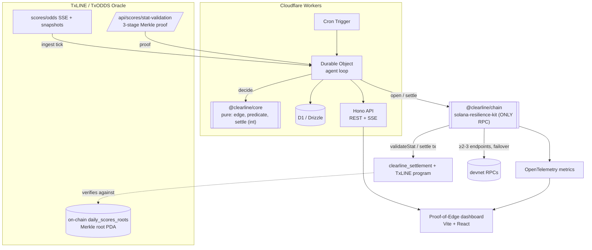

# ClearLine — Architecture

ClearLine is an autonomous settlement agent on **Solana devnet** that ingests live
TxLINE World Cup data, forms a deterministic edge, and settles it trustlessly against
TxLINE's on-chain Merkle roots.

## Layers

- **`packages/core`** — pure, integer-only decision/settlement math (`Predicate`,
  `evaluatePredicate`, `Edge`, `Position`, `settle`). ≥90% covered. No I/O.
- **`packages/txline`** — typed TxLINE client (auth, SSE ingest, snapshots,
  stat-validation), Zod-validated.
- **`packages/chain`** — the project's only RPC path: solana-resilience-kit pool
  (≥2–3 devnet endpoints, health, rate-limit, cluster guard), `TransactionSender`,
  OpenTelemetry. Codama-generated kit clients for the ClearLine + TxLINE programs.
- **`packages/agent`** — orchestration: ingest → decide → open → settle; idempotent.
- **`packages/contracts`** — the `clearline_settlement` Anchor program.
- **`apps/api`** — Hono on Workers: REST + SSE + agent control; D1 persistence; the
  Durable Object + Cron host the agent loop.
- **`apps/dashboard`** — the Proof-of-Edge UI incl. the RPC Health panel.

## Trustlessness

Settlement does not depend on a trusted reporter. The deciding statistic is proven via a
three-stage Merkle proof (`statProof → subTreeProof → mainTreeProof`) that reconstructs
to the **on-chain published `daily_scores_roots` Merkle root**; `validateStat` returns
whether the agent's predicate holds. The off-chain `evaluatePredicate` (core) mirrors the
on-chain check so decision and settlement agree.
